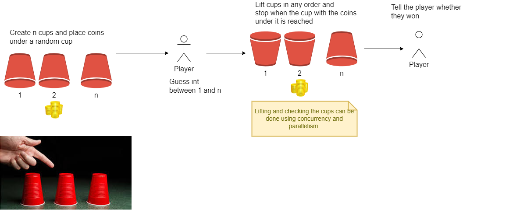

## Context with Cancel 
Simulates a game of guessing which cup a coin is under. 
Similar to the magic trick where the cups are shuffled and the 
There are simpler ways to code this but it is easy to conceptualise

1. A slice of cups is created and a 'coin' is placed in one of them
1. The player makes a guess using StdIn
1. The cups are lifted in parallel with goroutines. 
1. As soon as the coin is found the process is cancelled sot he remaining cups are not checked
1. The player is told whether they won

