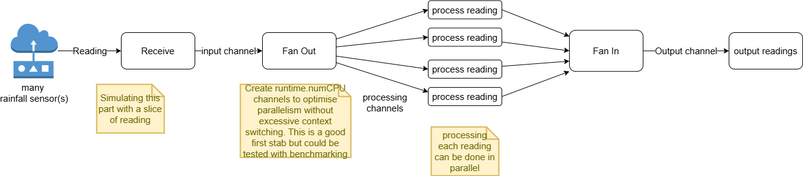

## fanout 

Simulates an input stream of sensor readings that are multiplexed onto several processing channels (fan out) 
Go routines receive readings from the processing channels. Each reading is 'processed' (simulated by producing a processed value and adding a time delay). The go routines send the processed readings to a single output channel (fan in) so the values can be output. 

