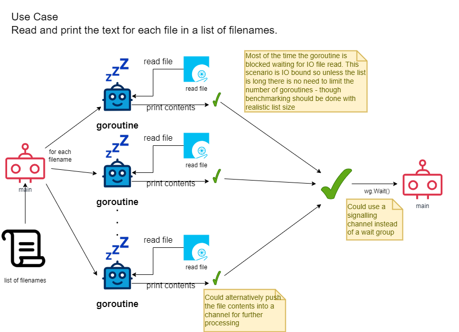

## IO bound
Using concurrency for io bound operation (file access)
The goroutines are blocked by the operating system file operations
While a goroutine is blocked then a goroutine that is in the runnable state and be run on the same CPU thread

